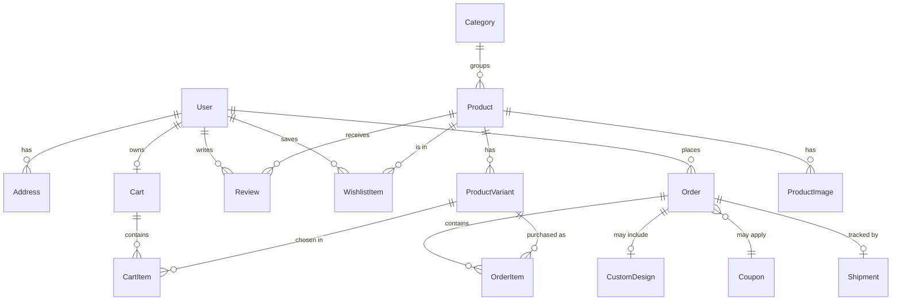

# Al Malak — Database Schema

PostgreSQL via **Prisma**. Multilingual content (AR/EN/HE) is stored as JSONB maps so a single row serves all three storefront languages. Money is stored in **agorot/minor units** (integers) to avoid float errors. Currency: ILS (₪).

---

## 1. Entity‑relationship diagram



---

## 2. Prisma schema

```prisma
// schema.prisma
generator client { provider = "prisma-client-js" }
datasource db { provider = "postgresql"; url = env("DATABASE_URL") }

/// JSON shape: { "ar": "...", "en": "...", "he": "..." }
enum Role        { CUSTOMER ADMIN STAFF }
enum OrderStatus { PENDING PAID PREPARING OUT_FOR_DELIVERY DELIVERED CANCELLED }
enum DiscountType{ PERCENT FIXED }

model User {
  id           String         @id @default(cuid())
  name         String
  email        String         @unique
  phone        String?        @unique
  passwordHash String?
  role         Role           @default(CUSTOMER)
  locale       String         @default("ar")
  addresses    Address[]
  orders       Order[]
  reviews      Review[]
  wishlist     WishlistItem[]
  cart         Cart?
  createdAt    DateTime       @default(now())
  updatedAt    DateTime       @updatedAt
}

model Address {
  id        String  @id @default(cuid())
  user      User    @relation(fields: [userId], references: [id])
  userId    String
  line1     String
  city      String
  area      String?
  notes     String?
  isDefault Boolean @default(false)
}

model Category {
  id        String    @id @default(cuid())
  slug      String    @unique
  name      Json      // Localized
  icon      String
  image     String
  sortOrder Int       @default(0)
  products  Product[]
}

model Product {
  id          String           @id @default(cuid())
  slug        String           @unique
  name        Json             // Localized
  description Json             // Localized
  category    Category         @relation(fields: [categoryId], references: [id])
  categoryId  String
  price       Int              // minor units
  compareAt   Int?
  rating      Float            @default(0)
  reviewCount Int              @default(0)
  isActive    Boolean          @default(true)
  badges      String[]         // ["new","bestSeller"]
  images      ProductImage[]
  variants    ProductVariant[]
  reviews     Review[]
  createdAt   DateTime         @default(now())
  @@index([categoryId])
}

model ProductImage {
  id        String  @id @default(cuid())
  product   Product @relation(fields: [productId], references: [id])
  productId String
  url       String
  alt       Json?
  position  Int     @default(0)
}

model ProductVariant {
  id         String      @id @default(cuid())
  product    Product     @relation(fields: [productId], references: [id])
  productId  String
  label      Json        // Localized e.g. {ar:"كبير"}
  sku        String?     @unique
  priceDelta Int         @default(0)
  stock      Int         @default(0)
  cartItems  CartItem[]
  orderItems OrderItem[]
}

model Cart {
  id        String     @id @default(cuid())
  user      User?      @relation(fields: [userId], references: [id])
  userId    String?    @unique
  sessionId String?    @unique  // guest carts
  items     CartItem[]
  updatedAt DateTime   @updatedAt
}

model CartItem {
  id        String          @id @default(cuid())
  cart      Cart            @relation(fields: [cartId], references: [id])
  cartId    String
  variant   ProductVariant  @relation(fields: [variantId], references: [id])
  variantId String
  quantity  Int             @default(1)
  @@unique([cartId, variantId])
}

model Order {
  id            String        @id @default(cuid())
  number        String        @unique   // human ref e.g. ALM-10293
  user          User?         @relation(fields: [userId], references: [id])
  userId        String?
  status        OrderStatus   @default(PENDING)
  items         OrderItem[]
  subtotal      Int
  discount      Int           @default(0)
  deliveryFee   Int           @default(0)
  total         Int
  coupon        Coupon?       @relation(fields: [couponId], references: [id])
  couponId      String?
  customDesign  CustomDesign?
  shipment      Shipment?
  contactName   String
  contactPhone  String
  deliveryNotes String?
  createdAt     DateTime      @default(now())
  @@index([userId])
}

model OrderItem {
  id          String         @id @default(cuid())
  order       Order          @relation(fields: [orderId], references: [id])
  orderId     String
  variant     ProductVariant @relation(fields: [variantId], references: [id])
  variantId   String
  nameSnapshot Json          // localized name at purchase time
  unitPrice   Int
  quantity    Int
}

model Coupon {
  id           String       @id @default(cuid())
  code         String       @unique
  type         DiscountType
  value        Int          // percent (0-100) or minor units
  minSubtotal  Int          @default(0)
  maxRedeems   Int?
  redeemed     Int          @default(0)
  expiresAt    DateTime?
  isActive     Boolean      @default(true)
  orders       Order[]
}

model CustomDesign {
  id         String  @id @default(cuid())
  order      Order   @relation(fields: [orderId], references: [id])
  orderId    String  @unique
  baseProduct String // mug|shirt|frame|cushion
  text       String?
  imageUrl   String?
  bgColor    String?
}

model Shipment {
  id            String   @id @default(cuid())
  order         Order    @relation(fields: [orderId], references: [id])
  orderId       String   @unique
  trackingCode  String   @unique
  carrier       String?
  status        String   @default("PENDING")
  estimatedAt   DateTime?
  deliveredAt   DateTime?
}

model Review {
  id        String   @id @default(cuid())
  product   Product  @relation(fields: [productId], references: [id])
  productId String
  user      User     @relation(fields: [userId], references: [id])
  userId    String
  rating    Int      // 1..5
  body      String
  isApproved Boolean @default(false)
  createdAt DateTime @default(now())
  @@unique([productId, userId])
}

model WishlistItem {
  id        String  @id @default(cuid())
  user      User    @relation(fields: [userId], references: [id])
  userId    String
  product   Product @relation(fields: [productId], references: [id])
  productId String
  @@unique([userId, productId])
}

model NewsletterSubscriber {
  id        String   @id @default(cuid())
  email     String   @unique
  locale    String   @default("ar")
  createdAt DateTime @default(now())
}
```

---

## 3. Design notes

- **Localized JSON** keeps content in one row; the app reads `field[locale]` with an `ar` fallback.
- **Money as integers** (agorot). Format at the edge with `formatPrice()`.
- **Guest carts** keyed by `sessionId`; merged into the user cart on login.
- **Price snapshots** on `OrderItem` keep historical orders correct when catalogue prices change.
- **Coupons** support percent/fixed, minimums, expiry, and redemption caps.
- **Order tracking** via `Shipment.trackingCode` (the public order‑tracking page queries this).
- Suggested indexes added on hot foreign keys; add full‑text search via Postgres `tsvector` or an external search service for the product search feature.
