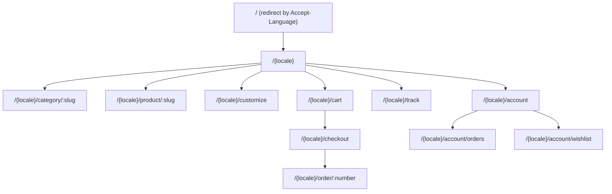
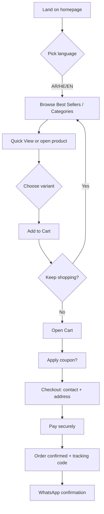
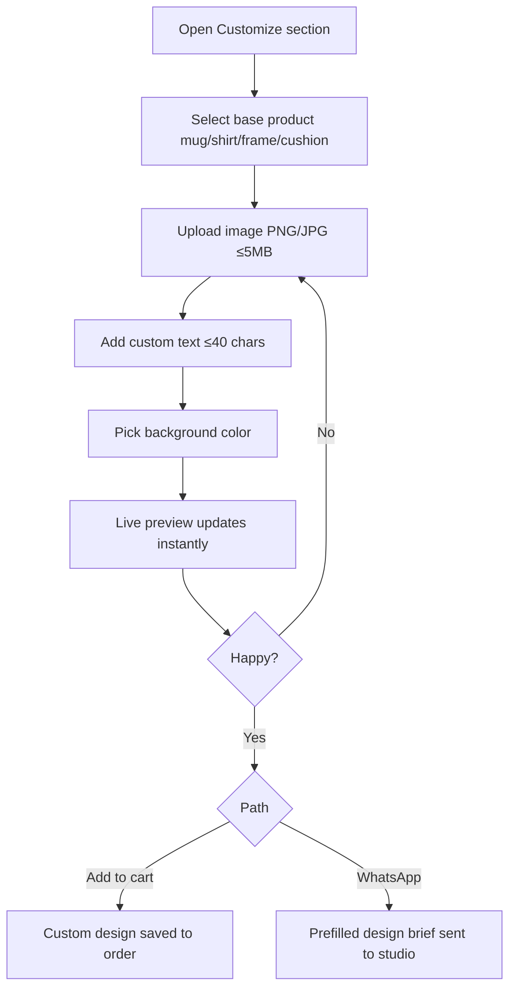
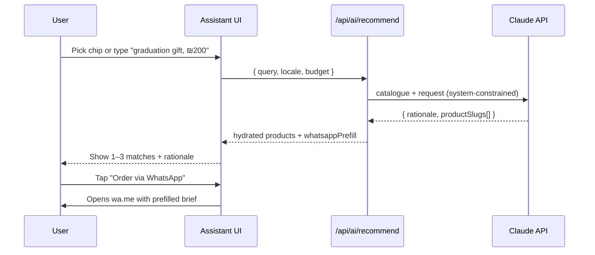
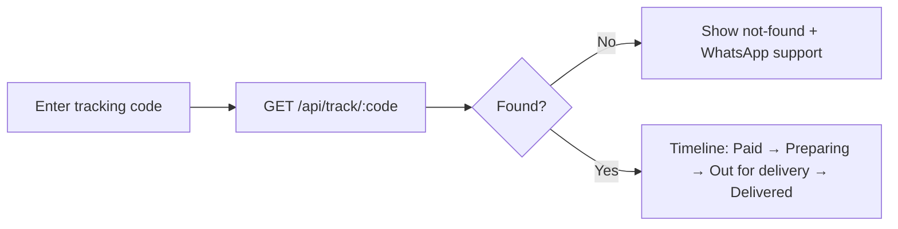
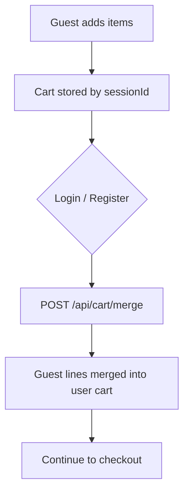
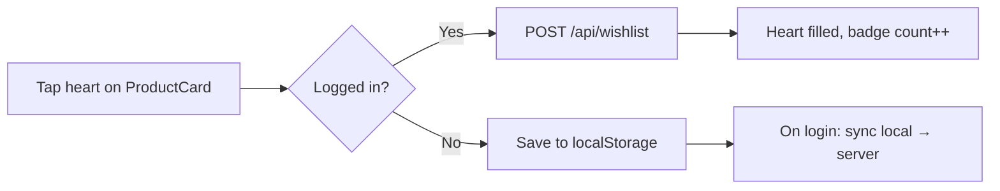

# Al Malak — User Flow Diagrams

Mermaid diagrams for the core journeys. Render on GitHub or any Mermaid viewer.

---

## 1. Sitemap

---

## 2. Browse → buy (happy path)

---

## 3. Custom printing flow

---

## 4. AI Gift Assistant

> The shipped homepage uses a deterministic on‑device matcher as a fallback when no backend is configured.

---

## 5. Order tracking (no login required)

---

## 6. Auth & guest‑cart merge

---

## 7. Wishlist

